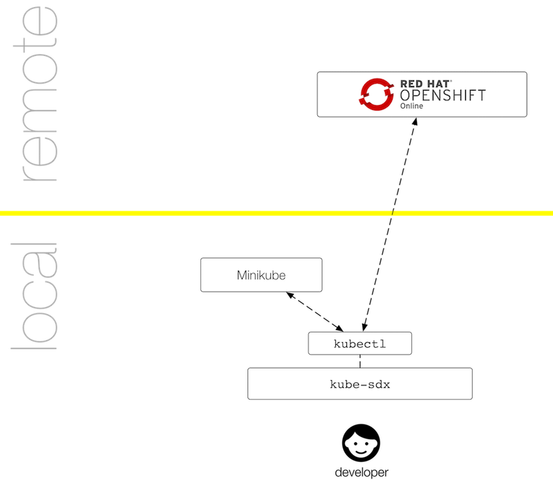
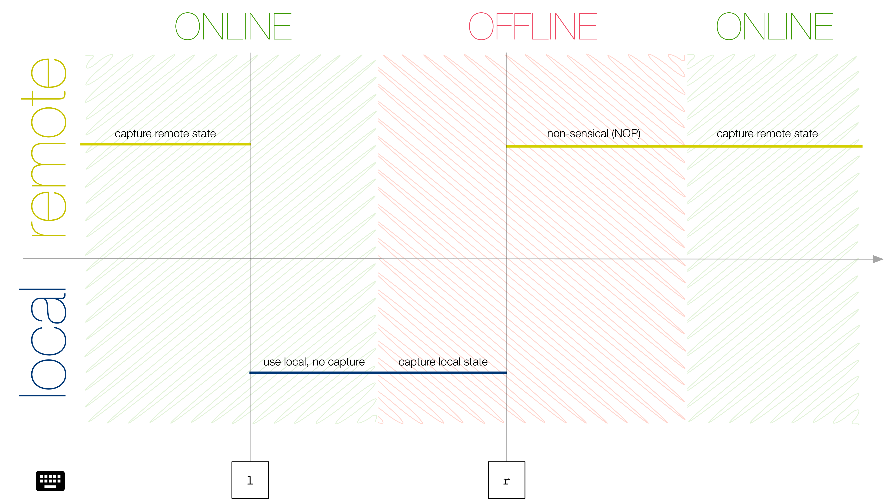

# Seamless Developer Experience

This is a prototype of a command line tool called `kube-sdx`, enabling you to automatically switch between different Kubernetes clusters and continue your work uninterrupted. The `sdx` stands for seamless Developer Experience (DX) for short and the goal is to help support you in your developing on Kubernetes workflow.



- [Use cases](#use-cases)
- [Prerequisits](#prerequisits)
- [Install](#install)
- [Use](#use)
    - [Basics](#basics)
    - [Policies](#policies)
    - [Interactive control](#interactive-control)
- [Platform-specific notes](#platform-specific-notes)
- [How it works](#how-it-works)

## Use cases


## Prerequisits

We assume you have `kubectl` (or OpenShift's `oc`) command line tool installed and configured as well as that you have a local cluster (Minikube, Minishift, Docker for Desktop) set up and at least one remote cluster configured. The tests have been carried out with the following configuration:

```bash
# Minikube:
$ minikube version
minikube version: v0.30.0

$ kubectl version --short
Client Version: v1.12.0
Server Version: v1.11.0

# OpenShift Online Pro:
$ kubectl version --short
Client Version: v1.12.0
Server Version: v1.9.1+a0ce1bc657
```

## Install

We support Linux, macOS, and Windows and you can download the binaries here:

- Linux: [kube-sdx_linux](https://github.com/mhausenblas/sdx/releases/download/0.2/kube-sdx_linux)
- macOS: [kube-sdx_macos](https://github.com/mhausenblas/sdx/releases/download/0.2/kube-sdx_macos)
- Windows: [kube-sdx_windows](https://github.com/mhausenblas/sdx/releases/download/0.2/kube-sdx_windows)

Download the binary for your platform, rename it to `kube-sdx` and put it on your path, and (for *nix systems) make it executable, for example on a macOS system, do:

```shell
$ curl -sL https://github.com/mhausenblas/sdx/releases/download/0.2/kube-sdx_macos -o kube-sdx
$ chmod +x kube-sdx
```

## Use

In the real world we seldomly have a single Kubernetes environment we're using but two or more we're switching between. This might be because we want to (testing) or we have to (offline environments such as on travel). Whenever you have two clusters (contexts) and want to continuously develop and deploy stuff, then `kube-sdx` is for you.

### Basics

Once downloaded and set up, you can launch `kube-sdx` like so:

```bash
$ kube-sdx --remote=$WORK_CONTEXT
```

Note that `--remote` is the only parameter you must supply, otherwise `kube-sdx` doesn't know what to track (and snapshot) and hence can't function properly. But what happens if you leave it out? Simply this:

```bash
$ kube-sdx
I'm sorry Dave, I'm afraid I can't do that.
I need to know which remote context you want, pick one from below and provide it via the --remote parameter:

CURRENT   NAME                                                      CLUSTER                               AUTHINFO                                       NAMESPACE
          default/192-168-99-100:8443/developer                     192-168-99-100:8443                   developer/192-168-99-100:8443                  default
          default/192-168-99-100:8443/system:admin                  192-168-99-100:8443                   system:admin/192-168-99-100:8443               default
          docker-for-desktop                                        docker-for-desktop-cluster            docker-for-desktop
          dok/api-pro-us-east-1-openshift-com:443/mhausenb          api-pro-us-east-1-openshift-com:443   mhausenb/api-pro-us-east-1-openshift-com:443   dok
          mh9sandbox/api-pro-us-east-1-openshift-com:443/mhausenb   api-pro-us-east-1-openshift-com:443   mhausenb/api-pro-us-east-1-openshift-com:443   mh9sandbox
*         minikube                                                  minikube                              minikube

```

So no worries, `kube-sdx` will gently remind you to set `--remote` in any case. If you want to see `kube-sdx` in action, why don't you check out the [walkthrough](walkthrough.md) of some typical sessions?

Also, while not strictly necessary, you will typically want to set `--policy`, it defaults to a conservative local context, otherwise.
How to set policies? The next section explains it.

### Policies

With `--policy` you set the initial context and what kind of resources to capture and consequently restore, after a switch from either `ONLINE` to `OFFLINE` or the other way round. The logic is as follows:

POLICY     | ONLINE | OFFLINE
---        | ---    | ---
`local:*`  | use `local` context, but no capture | use `local` context and capture it
`remote:*` | use `remote` context and capture it | doesn't make sense (NOP)

For example, if you'd use `--policy=local:deployments` and you're currently offline (that is, no connection to remote cluster) then `kube-sdx` would capture local resources of type `deployments` and once you're online, it would mirror these to the remote.
You can change parts of the policy (which context to use) using interactive control, and the how is explained in the next section.

From a temporal perspective, this is how it looks like to change policies:



### Interactive control

While you can use `kube-sdx` fully automated, you can also (asynchronously) interact with it in the following way (always terminate with an `ENTER`):

- `s` or `status` or `show status` will display the status in the form `Current status: using $SELECTED_CONTEXT context, watching namespace $NAMESPACE`.
- `l` or `local` or `use local` will manually override to use the local context (see above policies on valid combinations with the on/offline status).
- `r` or `remote` or `use remote` will manually override to use the remote context (see above policies on valid combinations with the on/offline status)

One use case for this is to test the tool, another is to mirror the state pro-actively.

## Platform-specific notes

Under Windows, you *must* specify the `SDX_KUBECTL_BIN` environment variable, since auto-discovery doesn't work there. Also, if you are using an OpenShift remote cluster, you typically want to set `SDX_KUBECTL_BIN` to `$(which oc)`.

## How it works

In a nutshell, `kube-sdx` keeps an eye on the API server of the configured remote cluster (via a simple HTTP `GET`) and if the connection detection fails, assumes you're offline. Once in offline mode, `kube-sdx` switches over to the local context and you can continue your work there. In the background, `kube-sdx` captures regular snapshots of certain key resources such as deployments or services and stores them in a YAML doc that gets applied to the respective environment, whenever a context switch occurs. 

Note that the naming of `local` and `remote` context is somewhat arbitrary, one could also call it primary and secondary context. The point being: the connection detection works against the remote (primary) context and the state capture and restore is on a bi-directional basis. This means that if your remote goes offline and you continue to work locally—for example, adding a new deployment—this will be reflected in the remote context once it comes back online again, and vice versa.

## Local development

If you want to play around with `kube-sdx` or extend it, here's what's needed:

```bash
$ go version
go version go1.10 darwin/amd64

$ go build -o kube-sdx && \
             ./kube-sdx \
             --namespace=mh9sandbox \
             --remote=mh9sandbox/api-pro-us-east-1-openshift-com:443/mhausenb
```

Above command will build the latest version, creating a binary called `kube-sdx` and execute it with the no `local` env defined (hence going with the default `minikube`), keeping the namespace `mh9sandbox` alive (default: `default`) and uses as the `remote` a context that specifies a project in OpenShift Online.